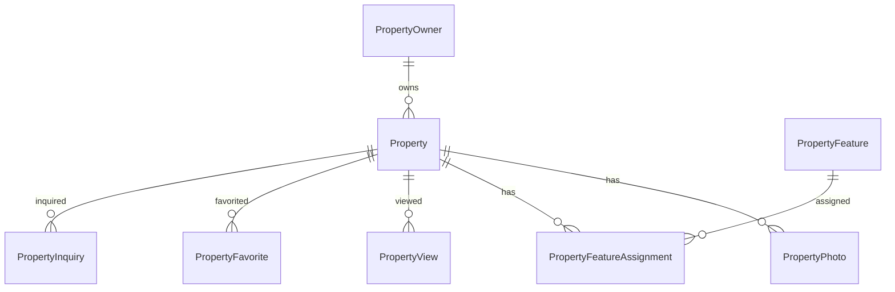

# Property Management Service - Модели данных

Документация по SQLAlchemy моделям для управления недвижимостью.

## Обзор архитектуры

Система использует **PostgreSQL** с **JSONB** полями для гибкого хранения структурированных данных и **UUID** в качестве первичных ключей для всех таблиц.

### Основные принципы:
- **Асинхронная работа** с базой данных через SQLAlchemy 2.0+
- **Строгая типизация** с использованием Enum классов
- **Гибкие JSON поля** для адресов, координат и метаданных
- **Оптимизированные индексы** для быстрых запросов
- **Аудит изменений** через временные метки

## Основные модели

### 1. Property - Недвижимость

**Таблица:** `properties`

Центральная модель системы, содержащая всю информацию о недвижимости.

#### Основные поля:

```python
class Property(Base, UUIDMixin, TimestampMixin):
    # Основная информация
    owner_id: UUID              # ID владельца
    title: str                  # Название
    description: str            # Описание
    
    # Классификация
    property_type: PropertyType # Тип (квартира, дом, коммерция)
    status: PropertyStatus      # Статус (доступна, сдана, обслуживание)
    condition: PropertyCondition # Состояние (отличное, хорошее, требует ремонта)
    
    # Местоположение
    address: JSONB              # Адрес в JSON формате
    coordinates: JSONB          # Координаты {lat, lng}
    
    # Характеристики
    total_area: Decimal         # Общая площадь
    living_area: Decimal        # Жилая площадь
    kitchen_area: Decimal       # Площадь кухни
    rooms_count: int            # Количество комнат
    floor: int                  # Этаж
    total_floors: int           # Этажность здания
    
    # Финансы
    monthly_rent: Decimal       # Месячная аренда
    security_deposit: Decimal   # Залог
    utility_cost: Decimal       # Коммунальные услуги
    currency: str               # Валюта (ISO код)
```

#### Enum типы:

```python
class PropertyType(enum.Enum):
    APARTMENT = "apartment"     # Квартира
    HOUSE = "house"            # Дом
    COMMERCIAL = "commercial"   # Коммерческая
    OFFICE = "office"          # Офис
    STUDIO = "studio"          # Студия
    PENTHOUSE = "penthouse"    # Пентхаус
    TOWNHOUSE = "townhouse"    # Таунхаус
    WAREHOUSE = "warehouse"    # Склад
    RETAIL = "retail"          # Торговое помещение
    LAND = "land"             # Земельный участок

class PropertyStatus(enum.Enum):
    AVAILABLE = "available"     # Доступна
    RENTED = "rented"          # Сдана
    MAINTENANCE = "maintenance" # На обслуживании
    INACTIVE = "inactive"      # Неактивна
    RESERVED = "reserved"      # Зарезервирована
    SOLD = "sold"             # Продана
```

#### JSON поля:

**address:**
```json
{
  "street": "ул. Тверская, д. 15, кв. 42",
  "city": "Москва",
  "district": "Тверской",
  "postal_code": "125009",
  "country": "Россия",
  "region": "Московская область"
}
```

**coordinates:**
```json
{
  "lat": 55.7558,
  "lng": 37.6176,
  "accuracy": 10
}
```

**amenities:**
```json
["parking", "elevator", "balcony", "gym", "pool", "security"]
```

### 2. PropertyPhoto - Фотографии

**Таблица:** `property_photos`

Хранение фотографий недвижимости с метаданными.

```python
class PropertyPhoto(Base, UUIDMixin, TimestampMixin):
    property_id: UUID           # Связь с недвижимостью
    url: str                    # URL фотографии
    thumbnail_url: str          # URL миниатюры
    caption: str                # Подпись
    photo_type: PhotoType       # Тип фото
    is_main: bool              # Главная фотография
    order_index: int           # Порядок отображения
    width: int                 # Ширина в пикселях
    height: int                # Высота в пикселях
```

**Типы фотографий:**
```python
class PhotoType(enum.Enum):
    EXTERIOR = "exterior"       # Внешний вид
    INTERIOR = "interior"       # Интерьер
    KITCHEN = "kitchen"         # Кухня
    BATHROOM = "bathroom"       # Ванная
    BEDROOM = "bedroom"         # Спальня
    LIVING_ROOM = "living_room" # Гостиная
    BALCONY = "balcony"        # Балкон
    VIEW = "view"              # Вид из окна
    FLOOR_PLAN = "floor_plan"  # План этажа
```

### 3. PropertyFeature - Характеристики

**Таблица:** `property_features`

Справочник характеристик и удобств недвижимости.

```python
class PropertyFeature(Base, UUIDMixin, TimestampMixin):
    name: str                   # Название характеристики
    description: str            # Описание
    category: FeatureCategory   # Категория
    is_active: bool            # Активна ли
    is_popular: bool           # Популярная характеристика
    icon: str                  # CSS класс иконки
    color: str                 # Цвет в HEX
```

**Категории характеристик:**
```python
class FeatureCategory(enum.Enum):
    AMENITY = "amenity"         # Удобства
    UTILITY = "utility"         # Коммуникации
    SECURITY = "security"       # Безопасность
    TRANSPORT = "transport"     # Транспорт
    INFRASTRUCTURE = "infrastructure" # Инфраструктура
    BUILDING = "building"       # Здание
    APPLIANCE = "appliance"     # Техника
```

### 4. PropertyOwner - Владельцы

**Таблица:** `property_owners`

Информация о владельцах недвижимости.

```python
class PropertyOwner(Base, UUIDMixin, TimestampMixin):
    owner_type: OwnerType       # Тип владельца
    
    # Физические лица
    first_name: str             # Имя
    last_name: str              # Фамилия
    middle_name: str            # Отчество
    birth_date: date            # Дата рождения
    
    # Юридические лица
    company_name: str           # Название компании
    tax_id: str                # ИНН
    registration_number: str    # ОГРН
    
    # Контакты
    email: str                  # Email
    phone: str                  # Телефон
    address: JSONB             # Адрес владельца
```

### 5. Модели взаимодействий

#### PropertyView - Просмотры
Отслеживание просмотров недвижимости с аналитикой.

#### PropertyFavorite - Избранное  
Избранная недвижимость пользователей.

#### PropertyInquiry - Запросы
Запросы информации о недвижимости от потенциальных арендаторов.

## Связи между таблицами



## Индексы для производительности

### Основные индексы:

1. **Поиск по владельцу и статусу:**
   ```sql
   CREATE INDEX idx_property_owner_status ON properties(owner_id, status);
   ```

2. **Фильтрация по типу и статусу:**
   ```sql
   CREATE INDEX idx_property_type_status ON properties(property_type, status);
   ```

3. **Поиск по цене:**
   ```sql
   CREATE INDEX idx_property_rent_range ON properties(monthly_rent);
   ```

4. **Поиск по местоположению:**
   ```sql
   CREATE INDEX idx_property_location ON properties((address->>'city'), (address->>'district'));
   ```

5. **Сортировка по дате:**
   ```sql
   CREATE INDEX idx_property_created_at ON properties(created_at DESC);
   ```

## Примеры использования

### Создание недвижимости:

```python
property_obj = Property(
    owner_id=owner_id,
    title="Просторная 3-комнатная квартира",
    property_type=PropertyType.APARTMENT,
    status=PropertyStatus.AVAILABLE,
    address={
        "street": "ул. Тверская, д. 15, кв. 42",
        "city": "Москва",
        "postal_code": "125009",
        "country": "Россия"
    },
    coordinates={"lat": 55.7558, "lng": 37.6176},
    total_area=Decimal("85.5"),
    rooms_count=3,
    monthly_rent=Decimal("120000"),
    currency="RUB"
)
```

### Поиск недвижимости:

```python
# Поиск по городу и типу
properties = await session.execute(
    select(Property)
    .where(
        Property.address['city'].astext == 'Москва',
        Property.property_type == PropertyType.APARTMENT,
        Property.status == PropertyStatus.AVAILABLE
    )
    .order_by(Property.created_at.desc())
)

# Поиск по диапазону цен
properties = await session.execute(
    select(Property)
    .where(
        Property.monthly_rent.between(50000, 150000),
        Property.status == PropertyStatus.AVAILABLE
    )
)
```

### Работа с характеристиками:

```python
# Добавление характеристики к недвижимости
assignment = PropertyFeatureAssignment(
    property_id=property_id,
    feature_id=feature_id,
    is_highlighted=True,
    display_order=1
)
```

## Миграции базы данных

### Инициализация Alembic:

```bash
cd services/property-service
alembic init alembic
```

### Создание миграции:

```bash
alembic revision --autogenerate -m "Create property tables"
```

### Применение миграций:

```bash
alembic upgrade head
```

### Инициализация с тестовыми данными:

```bash
python scripts/init_db.py
```

## Оптимизация производительности

### 1. Использование JSONB индексов:

```sql
-- Индекс для поиска по городу
CREATE INDEX idx_property_address_city ON properties USING GIN ((address->>'city'));

-- Индекс для поиска по удобствам
CREATE INDEX idx_property_amenities ON properties USING GIN (amenities);
```

### 2. Частичные индексы:

```sql
-- Индекс только для доступной недвижимости
CREATE INDEX idx_property_available ON properties(monthly_rent, total_area) 
WHERE status = 'available';
```

### 3. Составные индексы:

```sql
-- Для сложных запросов с сортировкой
CREATE INDEX idx_property_search ON properties(property_type, status, monthly_rent, created_at DESC);
```

## Валидация данных

Модели включают встроенную валидацию:

- **Положительные значения** для площади и цены
- **Корректные координаты** (широта: -90..90, долгота: -180..180)  
- **Валидные email адреса** и телефоны
- **Проверка ИНН** с контрольными суммами
- **Ограничения на размеры** текстовых полей

## Безопасность

- **UUID первичные ключи** предотвращают перебор ID
- **Soft delete** для важных данных
- **Аудит изменений** через временные метки
- **Валидация входных данных** на уровне схем Pydantic
- **Индексы на чувствительные поля** (email, телефон)

---

Эта архитектура обеспечивает **высокую производительность**, **гибкость** и **масштабируемость** системы управления недвижимостью.
